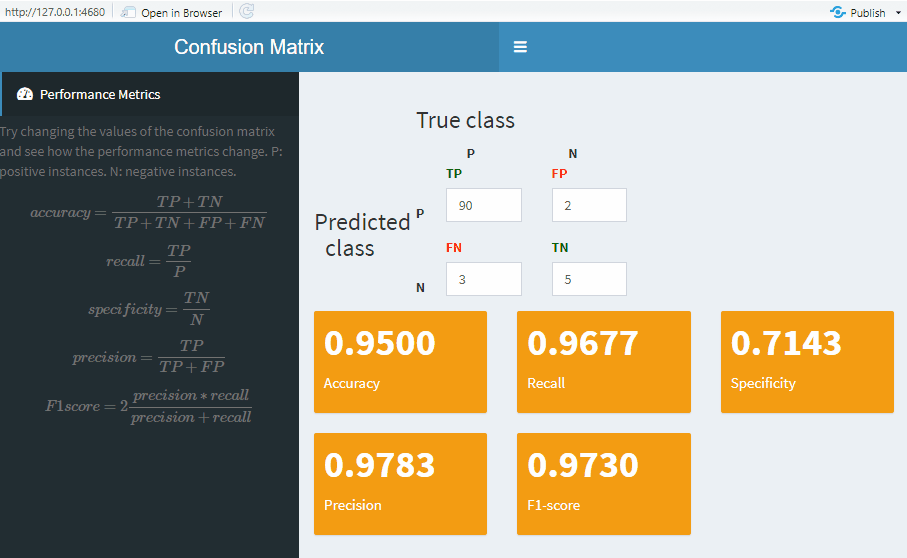

# Confusion matrix shiny app

This is an interactive confusion matrix made with R shiny apps. Change the values of the matrix and see how performance metrics change accordingly:

- Accuracy
- Recall (Sensitivity)
- Specificity
- Precision
- F1-score

# Demo



# Installation

Install the `shinydashboard` package.

```
install.packages("shinydashboard")
```

Open the file `shiny_confusion_matrix.R` in [RStudio](https://rstudio.com/products/rstudio/) and click the "Run App" button.

